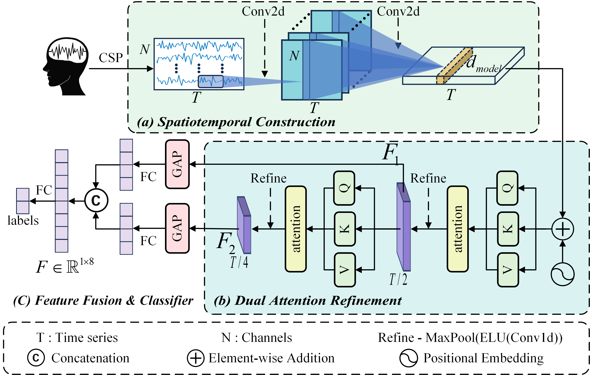

# DARNet

# Code for paper: DARNet: Dual Attention Refinement Network with Spatiotemporal Construction for Auditory Attention Detection
This paper introduces DARNet, a novel AAD network that constructs more expressive spatiotemporal feature representations, by capturing the spatial distribution characteristics of EEG signals.

Sheng Yan, Cunhang fan, Hongyu Zhang, Xiaoke Yang, Jianhua Tao, Zhao Lv. DARNet: Dual Attention Refinement Network with Spatiotemporal Construction for Auditory Attention Detection. In NeurIPS 2024.

# Preprocess
* Please download the AAD dataset for training.
* The public [KUL dataset](https://zenodo.org/records/4004271), [DTU dataset](https://zenodo.org/record/1199011#.Yx6eHKRBxPa) and MM-AAD(not yet open) are used in this paper.

# Requirements
+ Python3.9 \
`pip install -r requirements.txt`

# Run
* Modify the `getData` function in myutils.py to match the dataset
* Using main.py to train and test the model

